# 苏州 AI Agent 面试知识思维导图

> 中心：**AI Agent 工程师** = 模型决策 + 工具/检索 + 记忆状态 + 可评估上线  
> 苏州岗侧重：企业知识库 RAG、客服/流程助手、稳定性与落地效果

```mermaid
flowchart TB
  root["AI Agent 面试"]

  root --> llm["LLM基础"]
  root --> prompt["Prompt"]
  root --> rag["RAG"]
  root --> agent["Agent"]
  root --> memory["Memory"]
  root --> fw["框架"]
  root --> eng["工程"]
  root --> proj["项目表达"]

  llm --> llm1["Token与上下文"]
  llm --> llm2["Temperature"]
  llm --> llm3["幻觉与缓解"]
  llm --> llm4["结构化输出"]

  prompt --> p1["角色任务约束"]
  prompt --> p2["Few-shot"]
  prompt --> p3["防注入"]

  rag --> r1["切分 Embedding 检索生成"]
  rag --> r2["TopK"]
  rag --> r3["混合检索 BM25"]
  rag --> r4["重排 Rerank"]
  rag --> r5["HyDE 与改写"]
  rag --> r6["评测召回生成"]

  agent --> a1["ReAct 循环"]
  agent --> a2["Tool 设计"]
  agent --> a3["何时不用 Agent"]
  agent --> a4["Multi-Agent 路由"]
  agent --> a5["人工审核 HITL"]

  memory --> m1["短记忆消息窗"]
  memory --> m2["长记忆摘要向量"]
  memory --> m3["thread_id 隔离"]
  memory --> m4["Checkpointer"]

  fw --> f1["LangChain LCEL"]
  fw --> f2["LangGraph 状态机"]
  fw --> f3["流式输出"]
  fw --> f4["LangSmith"]

  eng --> e1["可观测与成本"]
  eng --> e2["评估黄金集"]
  eng --> e3["安全权限脱敏"]
  eng --> e4["缓存降级重试"]

  proj --> j1["业务问题方案贡献"]
  proj --> j2["指标延迟成本效果"]
  proj --> j3["踩坑与改进"]
  proj --> j4["架构图能画清"]
```

## 优先级

| 级别 | 内容 |
|------|------|
| **P0 必会** | LLM基础、Prompt、标准RAG、Agent/ReAct、Tool、简单Memory |
| **P1 常问** | LangGraph、混合检索/重排概念、评测排查、安全 |
| **P2 加分** | Multi-Agent、HITL、HyDE、可观测与成本优化 |

## 结合你的项目怎么讲

- **note_assistant**：RAG + 笔记工具 Agent + 向量库重建  
- **ai_chatbot**：多专家路由 + 人工审核（LangGraph 条件边）

## 7 天突击

1. LLM + Prompt  
2. 手写标准 RAG  
3. Tool + ReAct  
4. LangGraph 状态与记忆  
5. 混合检索 / 重排 / HyDE 概念  
6. 评测、安全、成本  
7. 两个项目串成故事（问题→方案→指标→踩坑）
